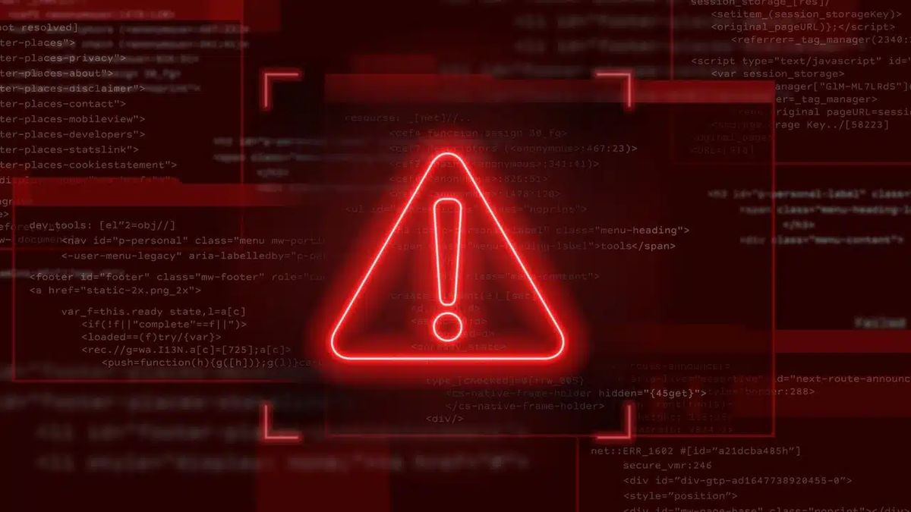
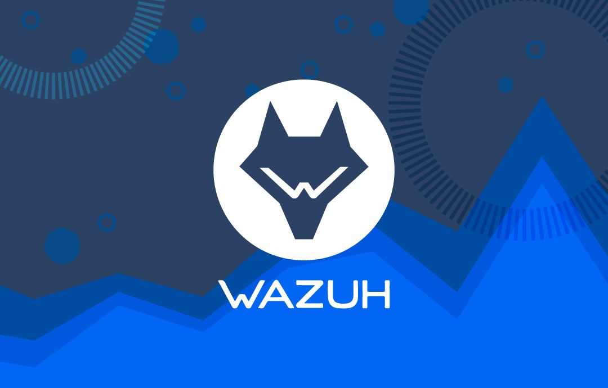

  

#   HOMELAB/SOC  *Analisis de Casos de Estudio*
Este proyecto está orientado al desarrollo y documentación de casos prácticos que simulan escenarios reales de ataque y defensa dentro de mi HomeLab.

Cada caso de estudio comienza con la ejecución de un escenario de ataque (Red Team) y continúa con su detección, análisis, investigación y respuesta desde la perspectiva de un Centro de Operaciones de Seguridad (SOC). Todos los casos son documentados desde su planificación hasta su conclusión.

El objetivo del proyecto es demostrar conocimientos prácticos en ciberseguridad mediante la implementación de una infraestructura de laboratorio, la utilización de herramientas y la aplicación de metodologías y procedimientos empleados en entornos profesionales.

# Objetivo 

Demostrar conocimientos y habilidades prácticas en ciberseguridad mediante el desarrollo de casos de estudio, utilizando herramientas y técnicas de Red Team y Blue Team, y aplicando procesos de detección, análisis y respuesta dentro de un entorno HomeLab/SOC.

# Arquitectura 

# Stack Stenico
 
### 🖥️ Sistemas Operativos

### 🛡️ SIEM & Monitoreo

### 🌐 Redes

### 🔍 Análisis de Seguridad 

### ⚔️ Pentesting

### 💻 Desarrollo

### ☁️ Infraestructura

### 📚 Frameworks & Buenas Prácticas

# 📋 Casos de Estudio

| Caso | Descripción |
|------|------------|
| [🎯 Orchestrated Attack Framework: Multi-Stage Brute Force & SQLi with Real-Time SIEM Detection (Wazuh)](./casos/caso-1) | Ataque orquestado mediante Scripts : Sqli + fuerza bruta + Analizis y monitoreo |
| |
| |
| |

# Resultados 

# Conclusiones 
